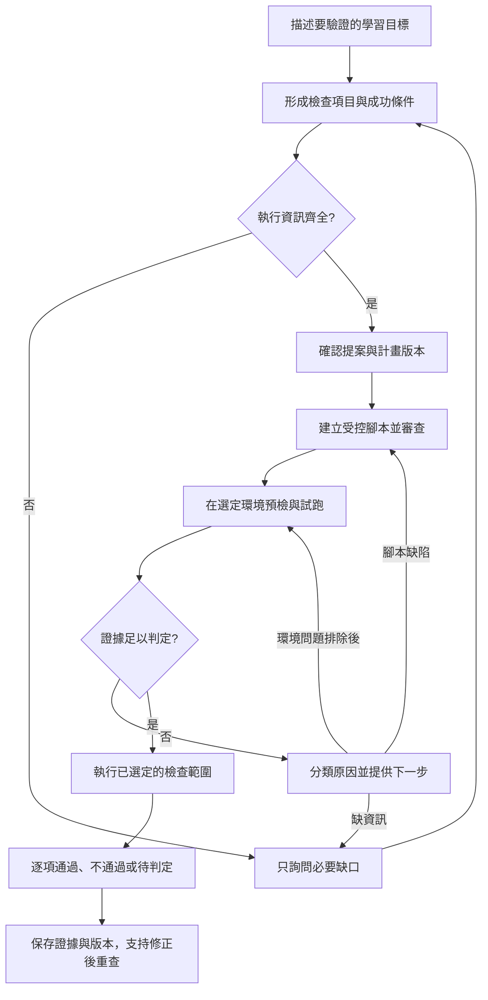

# AI 檢查流程合理性分析

分析日期：2026-09-09。範圍：目前工作區中的 Teacher Judge 對話、評分表、受管腳本生成、審查、執行與結果判讀。

結論：功能目的合理，但目前的完成單位偏向「產生評分表／腳本／執行紀錄」，尚未形成「確認教學目標是否達成，或明確指出阻礙並接續處理」的完整流程。對話語氣只是其中一層；真正需要補的是執行規格、工作流程狀態與失敗回饋。

這是程式碼審查及本機驗證器實驗，沒有呼叫正式 AI、連線學生 VM 或重現使用者的特定失敗紀錄。因此以下區分確定的程式行為與需要實際紀錄確認的原因。

使用者補充：對話未能產生可套用檢查點、腳本生成／修正失敗、執行失敗或無法判定，三個階段都有遇到困難。因此修正範圍應涵蓋整條流程。

## 目前流程與合理的部分

目前主要流程為：選擇評分表來源 → 對話產生修改提案 → 老師選擇並套用 → 製作腳本 → 靜態政策／品質檢查 → AI 安全複核 → 自動 approved → 選擇機器執行 → 驗證結果 JSON → AI 對齊評分項目並評分。

已有值得保留的設計：

- 評分表提案可選擇套用，對話及套用流程有版本衝突防護。
- 腳本保存評分表與 catalog 快照；已核准腳本重新生成會建立新版本。
- 靜態政策、品質檢查及 AI 審查形成多層關卡。
- 生成後的審查失敗可自動修正，總重試最多四次，相同失敗最多重試兩次。
- 執行端會檢查目標與資源歸屬，收集結構化證據，結果判讀也檢查項目完整性及證據引用是否存在。

因此不是完全沒有驗證或重試，而是目前閉環主要停留在「腳本通過審查」，未延伸至「執行後確實取得足以回答教學目標的證據」。

## 主要發現

### 1. 對話的能力與老師期待不一致（P1）

原始 `create_message()` 傳給 AI 的內容為評分表、catalog、對話歷史與附件，沒有本次腳本、審查原因、執行任務或 target 結果。原始 `chat_with_rubric()` 的輸出只有 `reply` 與 `updated_items`，也沒有可呼叫生成／執行流程的動作契約。

因此老師即使在聊天室說「幫我生成腳本」或「剛才失敗了，幫我修好」，這條路徑也沒有相應的執行能力或可靠的即時狀態。老師仍須自行轉到按鈕及分頁操作。

Prompt 又要求「無法確定時視為詢問」，一般對話允許以「你覺得……如何？」提供建議；這會增加委婉請求被當成純討論的可能。是否是本次實際卡點，需要原始對話確認。

建議：讓後端根據持久化狀態提供 `stage`、`blockers`、`next_action`，AI 負責理解目標、解釋缺口與提出動作。明確的「幫我／可以幫我產生」應形成具體提案或動作，不要求老師學特殊句型；實際生成、執行與成功狀態必須由後端回報。

本次先完成最小可行的腳本製作閉環：session 對話提供受限的
`request_check_script_creation` Tool Call，後端只接受無參數的建立請求並重新驗證評分表、項目與
revision；若相容模型只回傳一般 JSON `reply` 而沒有 `tool_calls`，後端只依最後一則明確的使用者
製作指令（不解析 AI 宣告文字）做窄範圍 fallback。回應加入 `workflow_action`，前端沿用既有腳本端點，
讓聊天指令與按鈕走同一個建立流程；按鈕、頁面狀態、完成及失敗原因都會保留在 UI，避免只剩短暫 toast。

依據：[訊息端點](../backend/app/api/routes/teacher_judge_sessions.py)、[對話服務](../backend/app/ai/teacher_judge/service.py)、[提示詞](../backend/app/ai/teacher_judge/prompt.py)。

### 2. 「能自動驗證」與「已具備執行條件」混在一起（P1）

目前 `check_steps` 只保存 template／command 引用，`cwd`、`argv`、timeout、成功條件都依賴自然語言說明，沒有結構化的必填驗證。

規劃 prompt 要求「執行 main.py，輸出整數 20」判為 auto，這在概念上合理。但生成 prompt 要求實際 cwd、命令與成功條件齊全，缺少資訊時不得猜路徑，而應輸出 unknown。兩層之間沒有明確的補資料關卡。

結果是老師看見「可自動檢查」，卻可能得到一份注定無法判定的腳本。

建議：保留 `detectable` 作為客觀可驗證性的分類，另設執行準備狀態。每個檢查至少包含目標、取證方式、型別化參數、預期條件、timeout、適用環境與缺少欄位。缺資料時先精準詢問，例如「還缺 main.py 的工作目錄」，不能假裝已準備完成。

依據：[評分項目 schema](../backend/app/ai/teacher_judge/schemas.py)、[規劃 prompt](../backend/app/ai/teacher_judge/prompt.py)、[生成 prompt](../backend/app/ai/teacher_judge/script_artifact_service.py)。

### 3. 尚未套用 AI 提案，也能製作腳本（P1）

原始前端 `canCreateScript` 只判斷有 analysis 且項目數大於零，沒有把 `pendingProposal` 列入阻擋條件。原始 `handleCreateScript()` 會 flush 已編輯內容，但不會套用待確認的 AI 提案。session 生成端點讀取的是目前已保存的 `file.analysis_json`。

可重現操作：已有項目 A → 要求 AI 改成 B → 收到待套用提案 → 未套用便按「製作檢查腳本」。此時生成來源仍是 A。這可能讓老師以為 AI 沒聽懂或生成內容不正確。

建議：有待處理提案時先引導「套用選取項目」或「保留目前版本」。生成請求帶入明確 revision／內容雜湊，由後端驗證；生成完成也應比對是否仍為當前版本。舊版本可保留供重現，但必須清楚標示與目前要求的差異。

依據：[RubricsTab 與 ChatPanel](../frontend/src/pages/course-operations/class-workspace/AiJudgePanel.jsx)、[session 腳本生成端點](../backend/app/api/routes/teacher_judge_sessions.py)。

### 4. 第一次生成的格式錯誤進不了自動修正（P1，已修正）

`build_reviewed_script()` 在進入審查迴圈之前就呼叫 `generate_script_content()`。後者遇到無效 JSON、缺少 `script_content` 或空內容會直接拋出 HTTPException。這類初次生成錯誤不會進入既有政策／品質修正迴圈，也還沒有保存 artifact。

所以「已有自動重試」並不涵蓋常見的模型格式錯誤。

本次追查進一步確認（含本機執行驗證，見文末驗證紀錄）：

- 同一函式內還有三處重新生成也沒有保護：靜態關卡失敗且無 fix hints 時的直接重新生成、patch 失敗後的 fallback 重新生成、AI review patch 失敗後的 fallback 重新生成，都是未包 try/except 的 `generate_script_content()` 呼叫。實測第二次模型呼叫遇到格式錯誤時，整個審查迴圈中止，剩餘重試額度作廢，已累積的 attempt 紀錄一併丟失。
- 截斷其實已有偵測：`_call_vllm()` 會檢查 `finish_reason == "length"` 並拋出錯誤轉成 502。初次生成就截斷時走同一條無重試路徑；「必須查 finish reason」這部分已由程式保證，缺口在失敗處理。
- `generate_script_content()` 拋格式錯誤時沒有任何 logger 呼叫；只有 `_call_vllm()` 層的網路與狀態錯誤有 `logger.error`。格式錯誤在伺服器端不會留下 log。
- 失敗那次呼叫的 token 用量也會丟失：`usage_records.append` 在生成函式成功回傳之後才執行。
- 呼叫鏈上沒有任何一層接住：`create_artifact()` 及 class scripts、session scripts 兩個建立端點都沒有 try/except，502 直接回前端，前端只剩 toast。
- 沒有 generation job model。原始 UI 進行中提示卻寫「可以離開此頁面，稍後回到腳本總覽查看結果」，在這條失敗路徑上不成立：老師離開後回來什麼都看不到；本次先改為要求留在頁面並保留失敗原因，job 化仍是後續範圍。
- 對話端點在 AI 失敗時會把失敗寫成 session 的 system notice；腳本生成端點沒有比照，修正時可直接參考此先例。

建議：生成任務先持久化，再區分模型呼叫錯誤、格式錯誤、政策失敗及品質失敗。把初次與迴圈內重新生成的可恢復錯誤（格式錯誤、截斷、timeout、上游 5xx）納入既有重試預算，以 `generation` phase 計入 failure signature；503 模型未設定維持不重試。對 `generate_script_content()` 補上 logger。記錄階段與原因，避免只留下 toast。長任務提供 job ID、狀態查詢與防重複送出的識別值。

依據：[generate_script_content、build_reviewed_script、create_artifact](../backend/app/ai/teacher_judge/script_artifact_service.py)、[模型呼叫與截斷偵測](../backend/app/ai/teacher_judge/service.py)、[session 腳本建立端點與對話失敗訊息先例](../backend/app/api/routes/teacher_judge_sessions.py)、[前端製作流程與離開頁面提示](../frontend/src/pages/course-operations/class-workspace/AiJudgePanel.jsx)。

### 5. 品質門檻偏重固定寫法，缺少目標覆蓋驗證（P1）

品質驗證器要求四個固定 helper，且無條件要求呼叫 `run_command()`；它也會阻擋包含「檢查」字樣的 check title。這些限制會消耗修正次數，但不一定代表檢查目的無法完成。

本機實驗確認：一份使用 Python 標準函式庫 `Path.is_file()` 判斷檔案存在、具備 helper 定義及 JSON 輸出的候選腳本，可通過政策檢查，卻只因沒有呼叫 `run_command()` 而被品質檢查拒絕。實驗僅將腳本文字交給驗證器，沒有執行候選腳本。

反方向的缺口：`check_script_quality()` 只接收腳本文字，無法機械式核對 rubric 是否逐項涵蓋；AI reviewer 主要負責安全及錯誤紀錄完整性。因此通過三道審查不能視為已驗證所有教學目標。

建議：固定 helper、結果封裝與工具呼叫由平台提供，AI 主要產生檢查計畫與參數。保留必要的安全與證據規則，將文案類規則改為非阻斷提示。每個 rubric item 必須映射到受控取證步驟與判定條件；沒有覆蓋的項目必須成為明確缺口。

依據：[品質驗證器](../backend/app/ai/teacher_judge/script_quality_validator.py)、[生成與 reviewer prompt](../backend/app/ai/teacher_judge/script_artifact_service.py)。

### 6. 結果格式通過不代表證據足夠（P1）

`validate_managed_script_output()` 驗證結果 schema，允許空 checks，也沒有拒絕重複 check ID。本機直接呼叫確認這兩種結果都回傳 `valid=True`。

後續 AI 判讀已有重要防護：必須覆蓋 rubric 項目、只能引用存在的 check ID，pass／fail 不能完全依賴 unknown／skipped。但它主要驗證引用存在與格式，沒有預先固定「此 rubric item 可由哪些 check、哪些 assertion 支持」。重複 ID 在 `checks_by_id` 字典中也會覆蓋前面的項目。

建議：根據本次已確認計畫驗證必要證據集合、ID 唯一性、適用性與項目映射。客觀條件如 exit code、HTTP status、精確輸出比對優先由程式判定；AI 負責解釋結果與整理建議。標準輸出為 19 就不能被文字敘述評為符合 20。

依據：[結果 schema 與驗證](../backend/app/ai/teacher_judge/script_policy.py)、[AI 判讀驗證](../backend/app/ai/teacher_judge/script_result_analysis_service.py)。

### 7. 執行失敗沒有回到可接續的修正流程（P1）

重新生成會帶入先前靜態／AI 審查回饋，但沒有從 run 讀取 timeout、missing runtime、權限錯誤或結果解析失敗。聊天室也沒有接入這些狀態。

`_save_analyzed_results()` 完成保存時會將 run 設為 completed，即使其中存在失敗 target 或 AI 判讀失敗；詳細摘要另存失敗數。這可以是合理的「任務處理結束」語意，但不能拿來表示學生達標或整份檢查已驗證完成。

建議：分開表示「執行任務狀態」「取證狀態」「學習目標判定」。依原因接續：

- 缺目錄、命令或判準：回到補資料，更新計畫後續跑。
- 連線／權限／runtime 問題：列出具體前置需求，修復後只重試受影響目標。
- 腳本或解析缺陷：附 run 證據產生新版本，經審查與試跑後重試。
- 學生作業確實不符：保留 fail 與證據，提供改善建議；不得為了得到 pass 而自動改寫判準。
- 證據已收集但 AI 解讀失敗：重試解讀，避免重跑整份腳本。

依據：[regenerate_artifact](../backend/app/ai/teacher_judge/script_artifact_service.py)、[執行結果保存](../backend/app/ai/teacher_judge/script_executor_service.py)、[ExecutionTab](../frontend/src/pages/course-operations/class-workspace/AiJudgePanel.jsx)。

## 建議的目標流程

「完成」表示每個項目都有可信判定，或明確的未解阻礙、負責處理的人與可執行下一步。不能把所有學生都通過當成系統應自動達成的目標，也不能將無法取證算成學生不會。

UI 主動作應隨狀態切換：補充必要資訊 → 套用檢查項目 → 產生並驗證 → 試跑 → 執行選定範圍 → 處理未完成項目。各分頁可以保留，但不應要求老師自行推導操作順序。

## 更直白的對話範例

- 描述目標後：「我已整理成 2 個檢查項目：程式正常結束、輸出整數 20。還缺 main.py 所在的工作目錄。」
- 提案待套用：「2 個項目已整理好，尚未套用。套用後即可產生腳本。」
- 腳本審查通過：「腳本已通過審查，尚未試跑。下一步選一台機器驗證執行結果。」
- 缺少 runtime：「這台機器找不到 python3，目前無法判定作業。補齊執行環境後可重試這台。」
- 實際不符：「程式正常結束，但輸出是 19，未符合 20。這是作業結果不符，檢查已完成。」
- AI 判讀失敗：「執行證據已保存，但結果解讀失敗。可以只重試解讀。」

以上句子都應由後端狀態支持，不能只寫進 prompt 後任由模型自行宣稱完成。

## 修正順序與驗收

第一階段先修正造成卡住或用錯版本的問題：待套用提案阻擋／版本確認、執行必填資料檢核、初次生成格式錯誤的有限重試，以及持久化失敗原因與下一步。同步調整對話意圖與文案。

第二階段建立結構化計畫、平台固定 runner、rubric 與證據映射、客觀條件判定及預檢試跑，降低自由生成腳本的不確定性。

第三階段接通執行失敗回饋、局部重試、只重試解讀、修正後比較及完成度總覽。

必要驗收情境：

1. 「可以幫我新增這些檢查嗎」能產生具體提案，不要求改用特定句型。
2. main.py 缺 cwd 時明確詢問該欄位，不生成注定 unknown 的可執行版本。
3. 有未套用提案時不會默默依舊版生成；生成期間改表也會標示版本落差。
4. 第一次生成無效 JSON 時有有限恢復與階段紀錄，不直接遺失整次工作。
5. 標準函式庫足以完成的檢查，不因未使用外部命令而被拒絕。
6. 缺必要 checks、重複 ID、錯誤證據映射都會被驗證擋下。
7. 學生輸出 19 與預期 20 不符；timeout 或權限不足則是待判定，兩者不混用。
8. 同一批機器部分失敗時清楚呈現原因，後續只重試必要步驟與目標。
9. AI 解讀失敗可沿用已保存證據，無須重新執行學生程式。
10. 已完成的回報可追溯到目標、計畫版本、腳本版本、機器、證據與判定。

## 驗證紀錄與限制

- 已直接執行目前工作區的政策／品質／輸出驗證函式，確認標準函式庫檢查被無條件 run_command 規則擋下、空 checks 通過及重複 check ID 通過，三項斷言成立。
- 2026-09-09 追查發現 4：以 monkeypatch 模擬 `_call_vllm` 回傳無效 JSON 後直接呼叫 `build_reviewed_script()`，兩項斷言成立：初次生成格式錯誤只呼叫模型一次即拋 502、無重試；迴圈內 fallback 重新生成遇格式錯誤時剩餘重試額度作廢。測試為臨時檔案，執行後已刪除，未留存於工作樹。
- 2026-09-09 修正發現 4（已修正）：初次與審查迴圈內的 `generate_script_content()` 錯誤已納入 `generation` phase 重試會計；可恢復錯誤（502/504）共用既有重試預算，503 維持直接拋出。重試耗盡時改回傳 review_failed 結果並保存 generation_error、attempt 紀錄，由 create_artifact 持久化，不再只留 toast。`generate_script_content()` 補上格式錯誤 logger；前端 RetrySummary 顯示 generation attempt 原因。同一批修正也把 AI review 呼叫本身的 502/504 納入 `ai_review_call` phase 重試，耗盡時保存失敗原因並回傳 review_failed。已新增七個 regression tests（生成四個、AI review 呼叫三個），teacher_judge 相關 133 tests 通過、ruff 通過、變更檔 mypy 通過；AiJudgePanel 24 tests 通過。未驗證：真實模型生成與 VM 端到端。
- 實驗沒有執行候選腳本，也沒有載入整個後端服務或連線資料庫。
- 其餘發現來自前後端呼叫鏈與提示詞閱讀，尚未做瀏覽器操作、真實模型生成或 VM 端到端驗證。
- 尚未取得使用者失敗當下的對話、生成回應、review issues 或 run reason_code；無法宣稱其中某一點就是本次事故的唯一原因。
- 本次已修改 Teacher Judge 對話／session 腳本建立契約、提示詞、前端聊天按鈕與狀態顯示，並新增對應 regression tests；未操作開始分析時發現的 teaching_classes.py 與 ClassWorkspacePage.jsx 既有變更。
- 已執行 `backend` Teacher Judge focused tests（140 passed）、`ruff`、`mypy`、`frontend` 全套 Vitest（323 passed）及 production build；build 僅有既有 chunk size 警告。
- 尚未以真實 vLLM tool parser、登入瀏覽器、資料庫服務或學生 VM 做端到端驗證；上述測試不能取代 live/authenticated E2E。
