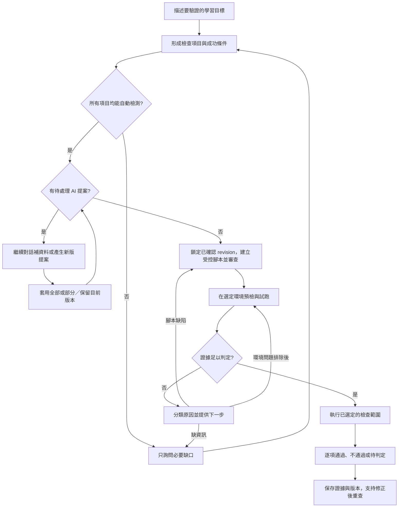

# AI 檢查流程合理性分析

分析日期：2026-09-09。範圍：目前工作區中的 Teacher Judge 對話、評分表、受管腳本生成、審查、執行與結果判讀。

結論：功能目的合理，但目前的完成單位偏向「產生評分表／腳本／執行紀錄」，尚未形成「確認教學目標是否達成，或明確指出阻礙並接續處理」的完整流程。對話語氣只是其中一層；真正需要補的是執行規格、工作流程狀態與失敗回饋。

這是程式碼審查及本機驗證器實驗，沒有呼叫正式 AI、連線學生 VM 或重現使用者的特定失敗紀錄。因此以下區分確定的程式行為與需要實際紀錄確認的原因。

使用者補充：對話未能產生可套用檢查點、腳本生成／修正失敗、執行失敗或無法判定，三個階段都有遇到困難。因此修正範圍應涵蓋整條流程。

2026-09-09 再補充兩項必要行為：只要存在尚未處理的 AI 提案，就不得製作新腳本；但老師仍須能繼續對話，補齊資料，並讓 AI 更新、補充或換成新提案。提案的待處理、套用、部分套用、保留目前版本及被新提案取代等結果都必須在重新整理後保留，不能只存在前端 state。

## 目前流程與合理的部分

目前主要流程為：選擇評分表來源 → 對話產生修改提案 → 老師選擇並套用 → 製作腳本 → 靜態政策／品質檢查 → AI 安全複核 → 自動 approved → 選擇機器執行 → 驗證結果 JSON → AI 對齊評分項目並評分。

已有值得保留的設計：

- 評分表提案可選擇套用，對話及套用流程有版本衝突防護。
- 腳本保存評分表與 catalog 快照；已核准腳本重新生成會建立新版本。
- 靜態政策、品質檢查及 AI 審查形成多層關卡。
- 生成後的審查失敗可自動修正，總重試最多四次，相同失敗最多重試兩次。
- 執行端會檢查目標與資源歸屬，收集結構化證據，結果判讀也檢查項目完整性及證據引用是否存在。

因此不是完全沒有驗證或重試，而是目前閉環主要停留在「腳本通過審查」，未延伸至「執行後確實取得足以回答教學目標的證據」。

## 主要發現

### 1. 對話的能力與老師期待不一致（P1）

原始 `create_message()` 傳給 AI 的內容為評分表、catalog、對話歷史與附件，沒有本次腳本、審查原因、執行任務或 target 結果。原始 `chat_with_rubric()` 的輸出只有 `reply` 與 `updated_items`，也沒有可呼叫生成／執行流程的動作契約。

因此老師即使在聊天室說「幫我生成腳本」或「剛才失敗了，幫我修好」，這條路徑也沒有相應的執行能力或可靠的即時狀態。老師仍須自行轉到按鈕及分頁操作。

Prompt 又要求「無法確定時視為詢問」，一般對話允許以「你覺得……如何？」提供建議；這會增加委婉請求被當成純討論的可能。是否是本次實際卡點，需要原始對話確認。

建議：讓後端根據持久化狀態提供 `stage`、`blockers`、`next_action`，AI 負責理解目標、解釋缺口與提出動作。明確的「幫我／可以幫我產生」應形成具體提案或動作，不要求老師學特殊句型；實際生成、執行與成功狀態必須由後端回報。

本次先完成最小可行的腳本製作閉環：session 對話提供受限的
`request_check_script_creation` Tool Call，後端只接受無參數的建立請求並重新驗證評分表、項目與
revision；若相容模型只回傳一般 JSON `reply` 而沒有 `tool_calls`，後端只依最後一則明確的使用者
製作指令（不解析 AI 宣告文字）做窄範圍 fallback。回應加入 `workflow_action`，前端沿用既有腳本端點，
讓聊天指令與按鈕走同一個建立流程；按鈕、頁面狀態、完成及失敗原因都會保留在 UI，避免只剩短暫 toast。

依據：[訊息端點](../backend/app/api/routes/teacher_judge_sessions.py)、[對話服務](../backend/app/ai/teacher_judge/service.py)、[提示詞](../backend/app/ai/teacher_judge/prompt.py)。

### 2. 「自動檢測支援」狀態未包含完整執行條件（P1，已修正第一階段）

修正前 `check_steps` 只保存 template／command 引用，`cwd`、`argv`、timeout、成功條件都依賴自然語言說明，沒有結構化的必填驗證。

原本規劃 prompt 只要未來可由客觀證據判斷，就可能將「執行 main.py，輸出整數 20」標為 auto；但生成 prompt 又要求實際 cwd、命令與成功條件齊全。兩層之間沒有明確的補資料關卡。

結果是老師看見「可自動檢查」，卻可能得到一份注定無法判定的腳本。

目前決策改為單一「自動檢測支援」語意，不再另外顯示執行準備狀態：

- `auto`：對外顯示「能自動檢測」。必須同時具備客觀判準、平台支援能力及完整執行資訊。
- `partial`：保留為既有 API 相容值，對外統一顯示橙色三角形「缺少資訊」。可由老師補齊服務名稱、main.py 工作目錄、Port、argv 或成功條件後重新判定。
- `manual`：對外顯示「不支援」。條件本質主觀，或平台目前沒有安全取證能力。

第一階段已為 `check_steps` 加入結構化 `parameters`。`python.run_entrypoint` 必須提供 cwd、argv、1 至 300 秒 timeout 與成功條件；`system.run_command` 必須提供 argv、timeout 與成功條件。後端會重新驗證整份評分表；只要任何項目不是完整 `auto`、自動檢測狀態待更新、缺少檢測方式、沒有有效 command 或缺少必要參數，就在模型呼叫前回傳 422，不產生腳本。前端同時停用入口並列出阻擋摘要，但不作為唯一安全關卡。

依據：[評分項目 schema](../backend/app/ai/teacher_judge/schemas.py)、[規劃 prompt](../backend/app/ai/teacher_judge/prompt.py)、[生成 prompt](../backend/app/ai/teacher_judge/script_artifact_service.py)。

### 3. 尚未套用 AI 提案，也能製作腳本（P1，第一階段已修正）

目前工作區已在 `getScriptCreationBlocker()` 加入 `pendingProposal` 判斷，所以同一頁、同一次載入且前端仍記得提案時，按鈕會停用，`handleCreateScript()` 也會再擋一次。這只修到瀏覽器記憶體內的正常操作，尚未形成可靠的工作流程契約。

已確認仍可繞過的原因如下：

- AI 提案只保存在 assistant message 的 `metadata_json.rubric_proposal` 與 `base_revision`；session 沒有「目前待處理提案」指標，訊息也沒有待處理／已套用／已略過等狀態。
- 切換 session 或來源時，前端先清空 `pendingProposal`；`listSessionMessages()` 載回訊息後只呼叫 `setMessages(rows)`，不會從歷史重建待處理提案。因此重新整理頁面就可能重新開放製作按鈕。
- 老師在已有提案後繼續一般對話時，只要本輪 AI 沒回傳 `rubric_proposal`，`handleSendMessage()` 便把 `pendingProposal` 設成 `null`。也就是「問一個補充問題」本身就可能解除防呆。
- 「保留目前版本」目前只清除本地 state，不會在後端留下已略過紀錄；另一個分頁或重新登入無法知道老師做過這個決定。
- `_resolve_workflow_action()` 只看本輪模型是否同時回傳 proposal，無法看到先前仍待處理的提案。老師下一輪在聊天室要求製作腳本時，後端仍可能回 `ready`。
- `POST /{session_id}/scripts` 只在 payload 有帶 `analysis_revision` 時才比對版本，完全不檢查提案狀態；省略 payload 或直接呼叫 API 可繞過 UI。
- `bounded_history()` 只把歷史轉成 role/content，沒有把結構化提案帶回模型。AI 可能從文字猜到曾有建議，卻無法可靠地針對同一份候選內容補資料、修訂或換版。

因此真正的問題不是「按鈕少一個 disabled」，而是系統沒有持久化且可併發驗證的提案生命週期。

#### 3.1 目標狀態與使用者行為

每個 session 同時間只允許一份 active proposal，避免老師同時面對多份都可套用的候選；所有舊提案仍保留在對話歷史中。

| 狀態 | 意義 | 可製作新腳本 | 可繼續對話 |
| --- | --- | --- | --- |
| `pending` | 最新提案尚未決定 | 否 | 是 |
| `applied` | 全部選取內容已套用 | 是，仍須通過評分表完整性檢查 | 是 |
| `partially_applied` | 只套用部分內容，其餘明確不採用 | 是，仍須通過評分表完整性檢查 | 是 |
| `dismissed` | 老師選擇保留目前版本 | 是 | 是 |
| `superseded` | 已由後續新提案取代 | 若無其他 `pending` 才可；通常由新版提案阻擋 | 是 |
| `legacy_unknown` | 上線前舊提案，無法可靠推斷曾套用或略過 | 依遷移規則 | 是 |

`pending` 的 `base_revision` 若已不同於目前 `analysis_revision`，提案仍是待處理，但標示為「評分表已變更，無法直接套用」。此時仍禁止製作腳本，老師可選擇保留目前版本，或請 AI 依目前評分表與舊提案產生新版。不要把 revision 不符自動解讀成老師已拒絕提案。

老師在 `pending` 狀態仍可正常：

1. 純詢問或補充背景；AI 沒產生新候選時，原提案維持 `pending`。
2. 補齊 cwd、Port、服務名稱、argv 或成功條件；AI 回傳完整新候選時，舊提案成為 `superseded`，新提案成為唯一 `pending`。
3. 要求修改、補充或「全部換一版」；後端把目前 active proposal 以獨立、server-owned context 提供給 AI，AI 必須回傳完整候選列表，不能只靠舊 assistant 文案猜測。
4. 套用全部或選取部分；後端原子化更新評分表 revision 與提案結果。
5. 選擇「保留目前版本」；後端持久化 `dismissed` 後才解除腳本防呆。

#### 3.2 最小持久化契約

不另建一套通用 workflow framework。沿用 `TeacherJudgeSessionMessage` 保存每次 AI 候選，在 `TeacherJudgeSession` 增加：

- `active_proposal_message_id: UUID | null`：目前唯一待處理提案的 assistant message ID；做索引，但比照 `summary_through_message_id` 不建立循環外鍵。
- `workflow_revision: int`：proposal 建立、取代、套用、略過、清除對話或切換來源時遞增，供長時間腳本生成做 compare-and-swap revalidation。

proposal message 的 `metadata_json` 使用固定 `proposal_state` 結構，至少保存：

- `status`、`base_revision`、完整 `candidate_items`。
- `supersedes_message_id`（若是更新／補充／換新版）。
- `resolved_at`、`resolved_by`、`result_revision`。
- `selected_item_ids`（部分套用時）與 `superseded_by_message_id`。

寫入 JSON 欄位時要建立並重新指派新 dict，避免 SQLAlchemy 未偵測到原地修改。session public 只需額外回傳 active message ID 與 `workflow_revision`；`GET /{session_id}/proposals/active` 與 chat response 回傳 message ID、status、base/current revision、是否可直接套用及完整候選。候選的儲存來源仍只有 message metadata，API 只是序列化該筆資料，避免 session 清單重複攜帶大 payload，也避免 active proposal 超出最近 50 則訊息後無法重建。

#### 3.3 API 與交易邊界

1. `create_message()` 在呼叫 AI 前載入 active proposal，把「已確認評分表」與「尚未套用候選」分成兩個清楚區塊傳入。一般回覆或模型失敗不改 proposal；只有合法且完整的 `updated_items` 才建立新 proposal，並在同一 transaction 將舊提案標為 `superseded`、更新 session pointer 與 `workflow_revision`。呼叫模型前後也須比對起始 `workflow_revision`，避免兩個分頁的對話回應倒序覆蓋 active proposal。
2. 新增 session-scoped resolve endpoint，例如 `POST /{session_id}/proposals/{message_id}/resolve`。payload 僅接受 `action=apply|dismiss`、`selected_item_ids` 與 `expected_analysis_revision`。apply 必須確認 message 是目前 active proposal、base revision 等於目前評分表、選取 ID 合法，然後在同一 transaction 更新 `analysis_json`、遞增 `analysis_revision`、寫入 proposal 結果並清除 pointer。重送已處理提案回穩定 409，不重複套用。
3. `POST /{session_id}/scripts` 在任何模型呼叫前，以後端 active pointer 阻擋 `pending`，回傳 409 `teacher_judge_proposal_pending`，包含 proposal message ID 與可顯示訊息；`analysis_revision` 改為 session UI 的必填值並須等於目前 revision。評分表空白／不完整仍沿用既有 422，狀態衝突與內容驗證不要混成同一錯誤。
4. 腳本生成可能耗時數分鐘，不能只檢查起點。保存 artifact 前再用 `workflow_revision`、`active_proposal_message_id is null` 與 `analysis_revision` 做條件式 revalidation；若期間出現新提案或評分表變更，回 409 且不保存看似最新的 artifact。實作時將「建立內容」與「持久化 artifact」拆開，或在既有 service 加入 session context guard，不能在 `create_artifact()` 已 commit 後才補救。
5. `_resolve_workflow_action()` 改查持久化 active proposal；聊天室要求製作腳本與按鈕請求共用相同 blocker 與 reason code。前端提示不是授權來源。
6. 清除對話或切換來源時，必須在同一 transaction 清除 active pointer 並遞增 `workflow_revision`。UI 確認文字要說明尚未套用提案也會被捨棄；明確清除後不要求保留已刪除訊息的歷史。

#### 3.4 前端收斂

- `RubricsTab` 以後端 `active_proposal` 重建 proposal，不再把本地 `pendingProposal` 當 source of truth；重新整理、換分頁與另一個瀏覽器分頁都得到相同狀態。
- `handleSendMessage()` 收到沒有新 proposal 的一般回覆時保留現有提案；收到新 proposal 時依 server 回傳 pointer 切換，不自行推斷 supersede。
- `ProposalPanel` 對 active proposal 顯示「待確認」「評分表已變更」與版本資訊；對歷史 proposal 顯示「已套用」「部分套用」「保留原版」「已被新版取代」，已處理項目唯讀。
- 保留聊天輸入能力，不因有 proposal 而禁用；只禁用「製作檢查腳本」。套用／保留動作送出期間才暫停重複提交。
- `getScriptCreationBlocker()` 接收 server proposal state。若 API 仍回 409，前端立即同步 session/messages 並顯示持久通知，處理舊頁面或跨分頁競態。
- 已核准的舊腳本仍保留其 rubric snapshot 與既有執行能力；本次不因新提案自動刪除、改寫或重跑舊 artifact。UI 只標示它不是依最新提案建立，避免擴大本次授權與資料影響。

#### 3.5 舊資料與上線策略

既有 proposal 沒有 resolution 事件，不能誠實推斷為已套用或已略過。migration 採一次性保守 reconciliation：每個 active session 只檢查最新 proposal；若其 `base_revision` 等於目前 file revision，設為 `pending` 並要求老師再做一次「套用」或「保留目前版本」，其餘舊提案標成 `legacy_unknown` 且不宣稱結果。這可能讓少數曾只在前端按過略過的老師多確認一次，但不會默默用錯版本製作腳本。

此變更會新增 SQLModel 欄位，實作時須建立 Alembic migration，先確認目前 heads/current 與實際 DB target；不對不明或 production DB 直接試跑。

#### 3.6 實作檔案與驗證矩陣

| 邊界 | 實作檔案／內容 | 驗證重點 |
| --- | --- | --- |
| Model／migration | `backend/app/models/teacher_judge_session.py`、新 Alembic revision | nullable pointer、`workflow_revision` 預設值、legacy reconciliation、upgrade/downgrade 只在隔離測試 DB 驗證 |
| Proposal domain | `backend/app/ai/teacher_judge/proposal_service.py`，重用現有 rubric schema | 建立／取代／全部套用／部分套用／dismiss 的 transaction 與 idempotency；不要建立通用 workflow framework |
| Session API | `backend/app/api/routes/teacher_judge_sessions.py`、`schemas.py`、`session_service.py` | instructor/class/session scope、archived read-only、active proposal 查詢、穩定 409、clear/source switch、腳本起點及保存前 revalidation |
| AI context | `backend/app/ai/teacher_judge/service.py`、`prompt.py` | current rubric 與 pending candidate 分隔；一般問答保留 pending；補資料／更新／換版回完整候選；模型不得自行把 proposal 宣告成已套用 |
| Frontend service／UI | `frontend/src/services/aiJudge.js`、`AiJudgePanel.jsx` 與樣式 | reload 恢復、聊天不被禁用、一般回覆不清 proposal、歷史狀態標籤、409 後重新同步、製作按鈕及 chat workflow action 一致阻擋 |
| Backend tests | `backend/tests/test_teacher_judge_sessions.py`，必要時補 script artifact focused case | assert pending 時 `create_artifact`／模型生成未被呼叫；跨分頁 workflow revision、resolve 原子性、舊資料 reconciliation、清除與來源切換 |
| Frontend tests | `AiJudgePanel.test.jsx`、service tests | pending blocker、active endpoint 還原、no-proposal response 保留、new proposal supersede、resolved history 唯讀與錯誤文案 |

實作完成後先跑 Teacher Judge session/script focused pytest、變更檔 Ruff 與 mypy，再跑 AiJudgePanel/service Vitest 及 production build；migration 只對明確的隔離測試資料庫驗證。這些檢查仍不等於登入後的多分頁競態、真實 vLLM 或 VM E2E，最後需補一輪 authenticated browser 驗收：分頁 A 保留 pending、分頁 B 直接製作、補資料產生新版、重新整理、部分套用、再製作腳本。

依據：[RubricsTab、ChatPanel 與腳本 blocker](../frontend/src/pages/course-operations/class-workspace/AiJudgePanel.jsx)、[前端 session API](../frontend/src/services/aiJudge.js)、[session 訊息與腳本端點](../backend/app/api/routes/teacher_judge_sessions.py)、[bounded history](../backend/app/ai/teacher_judge/session_service.py)、[session/message models](../backend/app/models/teacher_judge_session.py)。

### 4. 第一次生成的格式錯誤進不了自動修正（P1，已修正）

`build_reviewed_script()` 在進入審查迴圈之前就呼叫 `generate_script_content()`。後者遇到無效 JSON、缺少 `script_content` 或空內容會直接拋出 HTTPException。這類初次生成錯誤不會進入既有政策／品質修正迴圈，也還沒有保存 artifact。

所以「已有自動重試」並不涵蓋常見的模型格式錯誤。

本次追查進一步確認（含本機執行驗證，見文末驗證紀錄）：

- 同一函式內還有三處重新生成也沒有保護：靜態關卡失敗且無 fix hints 時的直接重新生成、patch 失敗後的 fallback 重新生成、AI review patch 失敗後的 fallback 重新生成，都是未包 try/except 的 `generate_script_content()` 呼叫。實測第二次模型呼叫遇到格式錯誤時，整個審查迴圈中止，剩餘重試額度作廢，已累積的 attempt 紀錄一併丟失。
- 截斷其實已有偵測：`_call_vllm()` 會檢查 `finish_reason == "length"` 並拋出錯誤轉成 502。初次生成就截斷時走同一條無重試路徑；「必須查 finish reason」這部分已由程式保證，缺口在失敗處理。
- `generate_script_content()` 拋格式錯誤時沒有任何 logger 呼叫；只有 `_call_vllm()` 層的網路與狀態錯誤有 `logger.error`。格式錯誤在伺服器端不會留下 log。
- 失敗那次呼叫的 token 用量也會丟失：`usage_records.append` 在生成函式成功回傳之後才執行。
- 呼叫鏈上沒有任何一層接住：`create_artifact()` 及 class scripts、session scripts 兩個建立端點都沒有 try/except，502 直接回前端，前端只剩 toast。
- 沒有 generation job model。原始 UI 進行中提示卻寫「可以離開此頁面，稍後回到腳本總覽查看結果」，在這條失敗路徑上不成立：老師離開後回來什麼都看不到；本次先改為要求留在頁面並保留失敗原因，job 化仍是後續範圍。
- 對話端點在 AI 失敗時會把失敗寫成 session 的 system notice；腳本生成端點沒有比照，修正時可直接參考此先例。

建議：生成任務先持久化，再區分模型呼叫錯誤、格式錯誤、政策失敗及品質失敗。把初次與迴圈內重新生成的可恢復錯誤（格式錯誤、截斷、timeout、上游 5xx）納入既有重試預算，以 `generation` phase 計入 failure signature；503 模型未設定維持不重試。對 `generate_script_content()` 補上 logger。記錄階段與原因，避免只留下 toast。長任務提供 job ID、狀態查詢與防重複送出的識別值。

依據：[generate_script_content、build_reviewed_script、create_artifact](../backend/app/ai/teacher_judge/script_artifact_service.py)、[模型呼叫與截斷偵測](../backend/app/ai/teacher_judge/service.py)、[session 腳本建立端點與對話失敗訊息先例](../backend/app/api/routes/teacher_judge_sessions.py)、[前端製作流程與離開頁面提示](../frontend/src/pages/course-operations/class-workspace/AiJudgePanel.jsx)。

### 5. 品質門檻偏重固定寫法，缺少目標覆蓋驗證（P1）

品質驗證器要求四個固定 helper，且無條件要求呼叫 `run_command()`；它也會阻擋包含「檢查」字樣的 check title。這些限制會消耗修正次數，但不一定代表檢查目的無法完成。

本機實驗確認：一份使用 Python 標準函式庫 `Path.is_file()` 判斷檔案存在、具備 helper 定義及 JSON 輸出的候選腳本，可通過政策檢查，卻只因沒有呼叫 `run_command()` 而被品質檢查拒絕。實驗僅將腳本文字交給驗證器，沒有執行候選腳本。

反方向的缺口：`check_script_quality()` 只接收腳本文字，無法機械式核對 rubric 是否逐項涵蓋；AI reviewer 主要負責安全及錯誤紀錄完整性。因此通過三道審查不能視為已驗證所有教學目標。

建議：固定 helper、結果封裝與工具呼叫由平台提供，AI 主要產生檢查計畫與參數。保留必要的安全與證據規則，將文案類規則改為非阻斷提示。每個 rubric item 必須映射到受控取證步驟與判定條件；沒有覆蓋的項目必須成為明確缺口。

依據：[品質驗證器](../backend/app/ai/teacher_judge/script_quality_validator.py)、[生成與 reviewer prompt](../backend/app/ai/teacher_judge/script_artifact_service.py)。

### 6. 結果格式通過不代表證據足夠（P1）

`validate_managed_script_output()` 驗證結果 schema，允許空 checks，也沒有拒絕重複 check ID。本機直接呼叫確認這兩種結果都回傳 `valid=True`。

後續 AI 判讀已有重要防護：必須覆蓋 rubric 項目、只能引用存在的 check ID，pass／fail 不能完全依賴 unknown／skipped。但它主要驗證引用存在與格式，沒有預先固定「此 rubric item 可由哪些 check、哪些 assertion 支持」。重複 ID 在 `checks_by_id` 字典中也會覆蓋前面的項目。

建議：根據本次已確認計畫驗證必要證據集合、ID 唯一性、適用性與項目映射。客觀條件如 exit code、HTTP status、精確輸出比對優先由程式判定；AI 負責解釋結果與整理建議。標準輸出為 19 就不能被文字敘述評為符合 20。

依據：[結果 schema 與驗證](../backend/app/ai/teacher_judge/script_policy.py)、[AI 判讀驗證](../backend/app/ai/teacher_judge/script_result_analysis_service.py)。

### 7. 執行失敗沒有回到可接續的修正流程（P1）

重新生成會帶入先前靜態／AI 審查回饋，但沒有從 run 讀取 timeout、missing runtime、權限錯誤或結果解析失敗。聊天室也沒有接入這些狀態。

`_save_analyzed_results()` 完成保存時會將 run 設為 completed，即使其中存在失敗 target 或 AI 判讀失敗；詳細摘要另存失敗數。這可以是合理的「任務處理結束」語意，但不能拿來表示學生達標或整份檢查已驗證完成。

建議：分開表示「執行任務狀態」「取證狀態」「學習目標判定」。依原因接續：

- 缺目錄、命令或判準：回到補資料，更新計畫後續跑。
- 連線／權限／runtime 問題：列出具體前置需求，修復後只重試受影響目標。
- 腳本或解析缺陷：附 run 證據產生新版本，經審查與試跑後重試。
- 學生作業確實不符：保留 fail 與證據，提供改善建議；不得為了得到 pass 而自動改寫判準。
- 證據已收集但 AI 解讀失敗：重試解讀，避免重跑整份腳本。

依據：[regenerate_artifact](../backend/app/ai/teacher_judge/script_artifact_service.py)、[執行結果保存](../backend/app/ai/teacher_judge/script_executor_service.py)、[ExecutionTab](../frontend/src/pages/course-operations/class-workspace/AiJudgePanel.jsx)。

## 建議的目標流程

「完成」表示每個項目都有可信判定，或明確的未解阻礙、負責處理的人與可執行下一步。不能把所有學生都通過當成系統應自動達成的目標，也不能將無法取證算成學生不會。

UI 主動作應隨狀態切換：補充必要資訊 → 檢視／更新 AI 提案 → 套用全部或部分／保留目前版本 → 確認全部能自動檢測 → 產生並驗證 → 試跑 → 執行選定範圍 → 處理未完成項目。任何 active proposal，或任一項為「缺少資訊／不支援／待更新」，都會阻擋整份新腳本製作，不產生依舊版或只覆蓋部分項目的腳本；active proposal 不阻擋老師繼續對話。

## 更直白的對話範例

- 描述目標後：「我已整理成 2 個檢查項目：程式正常結束、輸出整數 20。還缺 main.py 所在的工作目錄。」
- 提案待套用：「2 個項目已整理好，尚未套用。套用後即可產生腳本。」
- 提案補充中：「我已依你補充的 Port 更新為第 2 版提案；第 1 版已保留在歷史中但不再可套用。」
- 提案版本過期：「評分表已在提案後被修改。你可以請我依目前內容更新提案，或保留目前版本；完成其中一項後才能製作新腳本。」
- 腳本審查通過：「腳本已通過審查，尚未試跑。下一步選一台機器驗證執行結果。」
- 缺少 runtime：「這台機器找不到 python3，目前無法判定作業。補齊執行環境後可重試這台。」
- 實際不符：「程式正常結束，但輸出是 19，未符合 20。這是作業結果不符，檢查已完成。」
- AI 判讀失敗：「執行證據已保存，但結果解讀失敗。可以只重試解讀。」

以上句子都應由後端狀態支持，不能只寫進 prompt 後任由模型自行宣稱完成。

## 修正順序與驗收

第一階段先修正造成卡住或用錯版本的問題：建立 active proposal 持久狀態與歷史結果、讓已有提案時可繼續對話並以新版取代舊版、前後端阻擋新腳本、proposal resolve 原子交易、生成起點與保存前的 revision/workflow revalidation。既有自動檢測支援三態、執行必填資料檢核、後端全項目生成關卡、生成格式錯誤有限重試及持久化失敗原因維持不變。

第二階段建立結構化計畫、平台固定 runner、rubric 與證據映射、客觀條件判定及預檢試跑，降低自由生成腳本的不確定性。

第三階段接通執行失敗回饋、局部重試、只重試解讀、修正後比較及完成度總覽。

必要驗收情境：

1. 「可以幫我新增這些檢查嗎」能產生具體提案，不要求改用特定句型。
2. main.py 缺 cwd、服務缺名稱或 HTTP 檢查缺 Port 時顯示橙色三角形「缺少資訊」，並且不呼叫模型、不建立 artifact。
3. 產生提案後重新整理頁面、切換分頁或重新登入，active proposal 仍存在，製作按鈕仍停用；直接呼叫 session scripts API 得到穩定 409，且模型不會被呼叫。
4. 已有提案時繼續問一般問題，原提案仍為 `pending`；補資料或要求更新／補充／換新提案時只產生一份新 active proposal，舊提案顯示 `superseded`。
5. 全部套用、部分套用及保留目前版本都由後端持久化；重送、套用非 active 提案或 revision 不符不會重複／錯誤覆寫評分表。
6. 腳本生成期間若另一分頁產生新 proposal 或更新評分表，保存前 revalidation 失敗，不建立使用舊上下文的新 artifact。
7. 聊天室要求製作與按鈕製作共用同一 pending-proposal blocker；不能藉由下一輪無 proposal 回覆繞過。
8. 清除對話或切換來源會原子化清除 active pointer；一般歷史則能辨認已套用、部分套用、已保留與已取代狀態。
9. 第一次生成無效 JSON 時有有限恢復與階段紀錄，不直接遺失整次工作。
10. 標準函式庫足以完成的檢查，不因未使用外部命令而被拒絕。
11. 缺必要 checks、重複 ID、錯誤證據映射都會被驗證擋下。
12. 學生輸出 19 與預期 20 不符；timeout 或權限不足則是待判定，兩者不混用。
13. 同一批機器部分失敗時清楚呈現原因，後續只重試必要步驟與目標。
14. AI 解讀失敗可沿用已保存證據，無須重新執行學生程式。
15. 已完成的回報可追溯到目標、提案結果、評分表 revision、腳本版本、機器、證據與判定。
16. 任一項為缺少資訊、不支援或待更新時，整份評分表不能製作腳本；直接呼叫 API 會得到穩定 422。active proposal 則使用明確的 409 狀態衝突，兩者可被前端分別處理。

## 驗證紀錄與限制

- 已直接執行目前工作區的政策／品質／輸出驗證函式，確認標準函式庫檢查被無條件 run_command 規則擋下、空 checks 通過及重複 check ID 通過，三項斷言成立。
- 2026-09-09 追查發現 4：以 monkeypatch 模擬 `_call_vllm` 回傳無效 JSON 後直接呼叫 `build_reviewed_script()`，兩項斷言成立：初次生成格式錯誤只呼叫模型一次即拋 502、無重試；迴圈內 fallback 重新生成遇格式錯誤時剩餘重試額度作廢。測試為臨時檔案，執行後已刪除，未留存於工作樹。
- 2026-09-09 修正發現 4（已修正）：初次與審查迴圈內的 `generate_script_content()` 錯誤已納入 `generation` phase 重試會計；可恢復錯誤（502/504）共用既有重試預算，503 維持直接拋出。重試耗盡時改回傳 review_failed 結果並保存 generation_error、attempt 紀錄，由 create_artifact 持久化，不再只留 toast。`generate_script_content()` 補上格式錯誤 logger；前端 RetrySummary 顯示 generation attempt 原因。同一批修正也把 AI review 呼叫本身的 502/504 納入 `ai_review_call` phase 重試，耗盡時保存失敗原因並回傳 review_failed。已新增七個 regression tests（生成四個、AI review 呼叫三個），teacher_judge 相關 133 tests 通過、ruff 通過、變更檔 mypy 通過；AiJudgePanel 24 tests 通過。未驗證：真實模型生成與 VM 端到端。
- 2026-09-09 修正發現 2（已完成第一階段）：介面改為「能自動檢測／缺少資訊／不支援」三態，`partial` 保留為既有 API 相容值但顯示橙色三角形「缺少資訊」。新增結構化 command parameters 與後端全項目生成關卡；缺少 cwd、argv、timeout、成功條件、有效 command，或存在非 auto／待更新項目時，會在模型呼叫前回傳 422。聚焦 Teacher Judge 測試 156 passed、1 skipped；前端 AiJudgePanel 與 service 測試 51 passed；ruff、變更檔 mypy 與 production build 通過。未驗證：真實模型回傳新 parameters、登入瀏覽器操作與 VM 端到端。
- 實驗沒有執行候選腳本，也沒有載入整個後端服務或連線資料庫。
- 其餘發現來自前後端呼叫鏈與提示詞閱讀，尚未做瀏覽器操作、真實模型生成或 VM 端到端驗證。
- 尚未取得使用者失敗當下的對話、生成回應、review issues 或 run reason_code；無法宣稱其中某一點就是本次事故的唯一原因。
- 本次已修改 Teacher Judge 對話／session 腳本建立契約、提示詞、前端聊天按鈕與狀態顯示，並新增對應 regression tests；未操作開始分析時發現的 teaching_classes.py 與 ClassWorkspacePage.jsx 既有變更。
- 已執行 `backend` Teacher Judge focused tests（140 passed）、`ruff`、`mypy`、`frontend` 全套 Vitest（323 passed）及 production build；build 僅有既有 chunk size 警告。
- 尚未以真實 vLLM tool parser、登入瀏覽器、資料庫服務或學生 VM 做端到端驗證；上述測試不能取代 live/authenticated E2E。
- 2026-09-09 提案生命週期第一階段已實作：`TeacherJudgeSession` 增加 `active_proposal_message_id` 與 `workflow_revision`，Alembic revision `tjprop01_persist_proposal_state` 以保守規則重建可辨識的舊提案；新增 server-owned proposal service、active／resolve API、全部／部分套用與保留目前版本的原子處理，並讓一般對話保留 pending、更新提案時將舊版標為 `superseded`。session scripts API 現在會在模型呼叫前以穩定 409 `teacher_judge_proposal_pending` 阻擋 pending，且要求 `analysis_revision`；腳本保存前再以 session workflow revision、active pointer 與檔案 revision 做 compare-and-swap revalidation。前端 reload 由 active endpoint 還原提案，聊天不會因一般回覆清除 pending，歷史訊息顯示處理結果，套用／保留動作改走後端 resolve endpoint。
- 本次已執行 Teacher Judge session／script／file／template focused pytest（含 proposal persistence、pending blocker、partial apply、重送 409）、變更檔 Ruff、mypy、前端 AiJudgePanel／service Vitest 與 production build；migration 僅完成 revision／compile／語法檢查，未對不明或 production DB 執行 upgrade。仍未驗證登入後多分頁真實競態、真實 vLLM、資料庫服務與學生 VM E2E；這些 focused checks 不能取代 authenticated browser／live runtime 驗收。
