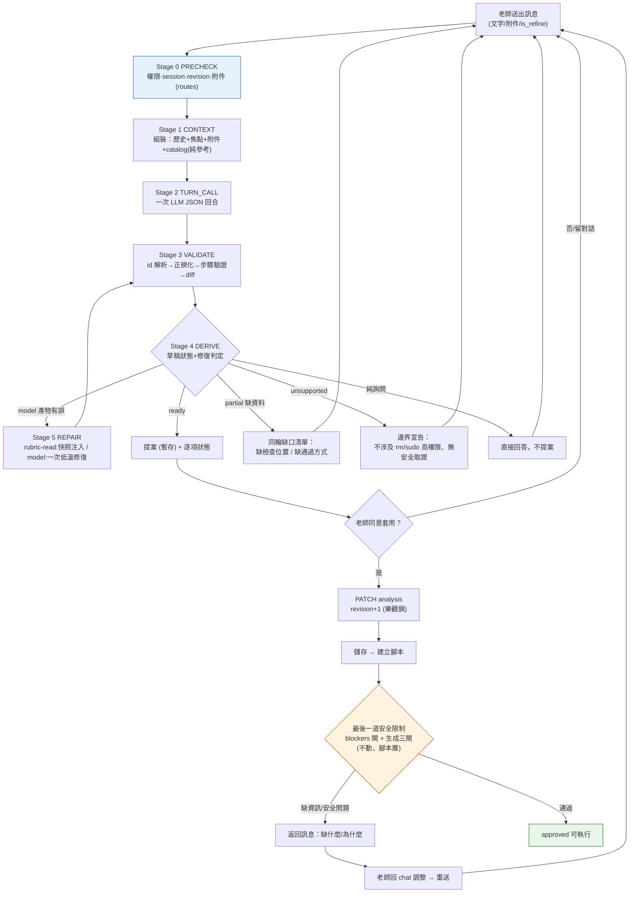

# Teacher Judge 對話層 Workflow 收斂更動計劃

日期：2026-09-13
性質：詳細分析 + 實作計劃（Phase 0-4 已於 2026-09-13 實作；Phase 5 待 live vLLM 驗收）。
範圍：**只涵蓋對話層**（session chat 全部線路、攔截、提案、追問、prompt 架構）；腳本層僅定義交接邊界——唯一例外是 §2-7 的「儲存並製作」擋表限級調整（使用者 2026-09-13 明確追加：導師審核項目不擋整張表）。
依據：工作樹實際程式碼逐函式實讀（`service.py` 2,252 行、`prompt.py` 263 行、`session_service.py` 的 `bounded_history`、`template_command_service.py`、`automation_support.py`、`teacher_judge_sessions.py` 的 `create_message`），行號以 `rg -n` 實測為準。
承接文件（不重複其內容）：

- `2026-09-11-teacher-judge-ai-chat-convergence-plan.md`（已實作：session chat 成為唯一輸入入口）
- `2026-09-12-teacher-judge-convergence-context-proposal-plan.md`（已實作：conversation_focus、gate 修正、capability review）
- `2026-09-13-teacher-judge-full-pipeline-and-safety-boundaries.md`（全景分析 + §0-B 目標流程圖）
- `2026-09-13-teacher-judge-upload-rubric-itemwise-analysis-plan.md`（已實作：附件 itemwise）

---

## 0. 一頁結論

對話層目前**功能都在，但組織發散**：四條線路分散在 route 與 service 的多個 flag 交叉、30 個攔截點散在六個層次、`proposal_status` 有三處各自衍生、缺口分類依賴中文 marker 表與 prose regex。本計劃不新增 API、不新增資料表、不改動公開契約，把這些線路與攔截**匯流成一個顯式的 chat workflow 狀態機**，並達成四個使用者目標：

| # | 使用者要求 | 收斂動作 |
|---|---|---|
| 1 | AI 審核以高危/語意限制；`template_key`/`command_key` 是系統細節參考、不影響流程 | 安全定位表（§2-3）：chat 層只查「唯讀語意紅線」；catalog 降級為純參考段；unknown command 有 argv 時伺服器端確定性 recovery（已存在），無法映射才丟 step 且只降級該項、不攔整輪 |
| 2 | 在 chat 層包裝成 workflow | 新增 `chat_workflow.py`：8 stage × 3 preset 的顯式狀態機（§2-1），公開契約不變 |
| 3 | 追問收斂：單純跟老師確認缺什麼；「我不涉及規劃 rm、sudo 高權限指令」邊界清楚；不輸出系統規則文字 | 缺口分類改由結構化欄位產生（§2-5）；單一最小問題；固定邊界句進 CORE prompt |
| 4 | 提案像 Agent：編輯單項/多項、新增、處理編輯 | ready-only 改 per-item 分流：Ready 進提案、partial 同輪並存為缺口清單；混合 add/update/delete 一輪內完成；套用後「把第 N 條改成 X」直達 update（§2-4） |

### 0-1 收斂後對話層流程圖



與使用者所畫 §0-B 流程圖的差異只有兩處（其餘節點一一對應）：

1. **C{有缺資料}節點分流到「同輪缺口清單」而非整輪卡住**：Ready 子集照常進提案，partial 項並存列出缺口——老師一次拿到全部結果。
2. **REPAIR 收斂為兩類**（rubric-read 快照修復 / model 一次低溫修復），取代現行 6 kind 矩陣。

### 0-2 節點 ↔ 程式對應（收斂後）

| 圖節點 | 收斂後歸屬 | 現行對應（供對照） |
|---|---|---|
| A 老師發起 | route `create_message`（teacher_judge_sessions.py:448） | 同左 |
| P0 PRECHECK | routes :455-489（不變） | 同左 |
| P1 CONTEXT | `chat_workflow._assemble_context()`（新） | `chat_with_rubric` :1431-1505 + `bounded_history`（session_service.py:605） |
| P2 TURN_CALL | `chat_workflow` 轉發 `_call_with_rubric_tool`（service.py:1269） | 同左 |
| P3 VALIDATE | `chat_workflow._validate_payload()`（新，組裝現行 parse/normalize/diff 純函式） | `parse_chat_update` :1514-1593 + `_resolve_add_candidates` :570 + `_normalize_rubric_items` :348 + `_normalize_check_steps` :216 + `_proposal_changes` :702 |
| Stage 4 DERIVE | `_derive_turn_outcome()`：唯一狀態衍生點（新） | 三處散點：parse 白名單 :1535-1544、repair 判斷 :1621-1641、終局重推導 :1838-1852 |
| Stage 5 REPAIR | `chat_workflow._repair()`：兩類修復 | `proposal_repair_kind` :1621 + while 迴圈 :1646-1769 |
| Stage 6 REPLY | `chat_workflow._compose_reply()` | `:1789-1852` + `_teacher_missing_gap_reply` :977 + `_proposal_unavailable_reply` :1073 + `_itemwise_reply` :2131 |
| Stage 7 PERSIST | routes :546-615（focus/metadata 契約不變） | 同左 |
| E/Q/B/W 輸出 | 同一 response + `metadata_json.item_results` | 提案=response 欄位；缺口=prose（normal）/item_results（itemwise） |
| J 最後一道安全限制 | `ensure_script_generation_supported`（automation_support.py:170）+ `build_reviewed_script` 三閘（script_artifact_service.py:895）；擋表限級調整見 §2-7（導師審核項目不擋整張表） | 同左；前端同構擋 `getScriptCreationBlocker`（AiJudgePanel.jsx:231-259） |

### 0-3 不變的契約（本計劃不觸碰）

- 公開 API：`POST .../messages` 的 request/response 欄位（`TeacherJudgeSessionChatResponse`，schemas.py:237-242）。
- 資料 ownership：對話/附件→DB；提案→前端暫存（刷新即失，有意契約）；正式表→`analysis_json`+`analysis_revision`。
- 安全：rubric-read gate、`system.run_command` 受控 runner、timeout 1-300s 夾擠、revision 三閘、腳本層全部閘門（唯一例外：§2-7 導師審核限級調整）。
- DB schema、Alembic、attachment lifecycle、`message_type` 枚舉。

---

## 1. 現行對話層分析

### 1-1 四條線路（發散現狀）

| 線路 | 觸發 | prompt 組合 | 服務入口 | 線路特有行為 |
|---|---|---|---|---|
| ① 一般 chat | 無附件、非 refine | `SITUATION_NORMAL` + `SESSION_REQUIREMENT_PROPOSAL_INSTRUCTION` + catalog | `chat_with_rubric`（service.py:1406） | `ready_only=True`：partial/manual 候選整輪不進提案 |
| ② 全表潤飾 | `is_refine=True` | `SITUATION_REFINE` + `DIRECT_RUBRIC_UPDATE_INSTRUCTION` | 同上 | `tool_choice` 強制讀表（:1511）、`ready_only=False`、空 diff 合法（:1570-1571）、user/assistant 都 `ui_hidden`（routes:480/:555） |
| ③ 附件 itemwise | 有附件、非 refine | `ATTACHMENT_EXTRACTION_SYSTEM_TEMPLATE` 拆項 → 逐列 `analyze_requirement_item` | `analyze_attachments_itemwise`（service.py:2157） | 強制 add（`coerce_to_add=True`，:1546-1552）、逐列 prompt 隔離、id 重編（:2039-2041） |
| ④ 無檢查表 chat | `file is None` | 同① | 同上 | 提案一律丟棄+改寫回覆（routes:540-545） |

分支點分散在兩處：route 的 `if attachments and not payload.is_refine`（routes:501）與 service 內部的 `is_refine`/`allow_add_without_rubric` 兩 flag 交叉（`ready_only=not is_refine` :1579、`require_rubric=is_refine` :1511、mode instruction 切換 :1448-1453、「# 本次新增邊界」附加段 :1465-1471）。**同一個「做什麼」的決定由 4 個 flag 在 2 個檔案共同表達**。

### 1-2 提示詞架構如何牽動整套流程

`CHAT_SYSTEM_TEMPLATE`（prompt.py:17-129，實測 6,711 字）是單層平鋪，四個 replace 區塊就是四個流程開關：

| prompt 區塊 | 流程影響 |
|---|---|
| `{situation_instruction}` → NORMAL/REFINE（service.py:1447） | 決定線路①/②；REFINE 內含 12 個小節規則（一致性/可驗證性/達成狀態/補空白/語氣） |
| `{proposal_mode_instruction}` → 兩擇一（:1448-1453） | 決定「必須先呼叫 get_current_checklist + 空 diff 合法」vs「暫存提案、add 可免讀表」 |
| `{template_command_context}`（:1454-1463） | catalog + 環境說明；規則 7/8（prompt.py:81-88）引用它決定 check_steps 策略 |
| `{attachment_context}`（:1476-1494） | 決定附件 user turn 是否追加與「幫我增加這些項目」的固定語意 |
| `allow_add_without_rubric` 附加段（:1465-1471） | itemwise 專用：add-only、不讀表；同時在 parse 端改寫操作 |

安全紅線（唯讀、不提權、不破壞、不 shell）在四處重複：決策規則 8 子條（prompt.py:83-88）、`SITUATION_NORMAL` 處理原則、`TEMPLATE_COMMAND_CONTEXT_TEMPLATE` 說明（prompt.py:10）、`GENERAL_COMMAND.description`（template_command_service.py:35-40）。對小型模型造成 instruction competition，也讓「改一句紅線」要同步四處。

### 1-3 攔截點全表（chat 層，30 個）

**Route 層（teacher_judge_sessions.py）**

| # | 攔截 | 位置 | 失敗行為 |
|---|---|---|---|
| R1 | 身分/班級 | `_access`（:455 呼叫） | 401/404 |
| R2 | session 綁定 + archived | :456-457 | 404/409 |
| R3 | revision 預檢 | :460-472 | 409 |
| R4 | 空訊息+附件 | :473-474 | 422 |
| R5 | 附件歸屬/狀態/數量 | :475（attachment_service） | 400/409 |
| R6 | 無檢查表禁提案 | :540-545 | 靜默丟棄+改寫回覆 |
| R7 | 生成後競態 revalidation | :579-601 | 409 `teacher_judge_context_changed`（丟 AI 回覆） |
| R8 | 失敗持久化 | :563-578 | `system_notice` 訊息 |

**Parse/驗證層（service.py）**

| # | 攔截 | 位置 | 失敗行為 |
|---|---|---|---|
| V1 | JSON 解析失敗 | parse_chat_update try/except（:1584） | 提案 None、退化純文字 |
| V2 | proposal_status 白名單 | :1535-1544 | 未知值 → None |
| V3 | add id 確定性解析 | `_resolve_add_candidates` :570／`_reassign_new_add_ids` :644 | 伺服器改寫（撞 id 不同 title → 仍為 add 配新 id） |
| V4 | item 正規化 | `_normalize_rubric_items` :348 | 別名容錯；`detectable` 降級與缺口注入（:415-439） |
| V5 | check_steps 驗證+argv recovery | `_normalize_check_steps` :216 + `validate_check_steps_with_issues`（template_command_service.py:133-203） | 有效 argv recovery 成 `system.run_command`（:270-317）；無法映射 → 丟 step + issue |
| V6 | timeout 夾擠 | template_command_service.py:190-197 | 補 `DEFAULT_SYSTEM_COMMAND_TIMEOUT_SECONDS=30` |
| V7 | diff 計算 | `_proposal_changes` :702 | `ready_only` 過濾 + 9 欄逐欄比較 |
| V8 | rubric-read gate | `_proposal_requires_loaded_rubric` :525 + closure :1604 + `needs_rubric_read` :1615 | 純 add 豁免；其餘未讀表 → 攔 |

**修復層（service.py）**

| # | 修復 | 位置 |
|---|---|---|
| F1 | 6 kind 修復迴圈（`rubric_read`/`invalid_check_steps`/`manual_capability`/`missing_candidate`/`missing_status`/`ready_without_proposal`），最多 2 次、同 kind 不重複 | `proposal_repair_kind` :1621-1641 + while :1646-1769 |
| F2 | 快照注入修復（取代強制 tool call） | `_rubric_snapshot_for_repair` :193-213 + :1735-1752 |
| F3 | `manual_capability` 獨立 focused 修復（temperature=0.0、只帶最近 6 則+被拒候選+可用 command） | :1677-1728 |

**終局層（service.py）**

| # | 攔截 | 位置 | 失敗行為 |
|---|---|---|---|
| T1 | `stateful_proposal_without_rubric_read` | :1771-1787 | 丟提案 + 固定回覆 + 攔截日誌 |
| T2 | `ready_claim_without_valid_proposal` | :1802-1852 | fallback reply + 三分狀態重推導（partial→needs_information、invalid/明確宣告→unsupported、未宣告 manual 草稿→needs_information） |
| T3 | recovery 成功的 reply 覆蓋 | :1796-1800 | 直接改寫老師看到的回覆 |
| T4 | 結構化攔截日誌 | `_log_ai_intercept` :517-522 | warning |

**跨輪層**

| # | 機制 | 位置 |
|---|---|---|
| X1 | focus 修剪（≤8 條、每條 ≤500 字） | `_conversation_focus_from_content` :73-133 |
| X2 | focus 注入過濾（只注 unresolved） | `bounded_history`（session_service.py:694-708） |
| X3 | 防重複追問（prompt 禁令 + 結構化偵測） | prompt.py:75 + `_structured_requirement_needs_candidate` :136-158 |

**itemwise 層**

| # | 攔截 | 位置 |
|---|---|---|
| I1 | 拆解失敗整批失敗 | `_parse_attachment_extraction` :1871 + :2174-2190 |
| I2 | 逐列失敗隔離 | `_itemwise_error_result` :2068 |
| I3 | 非 ready 列降級 | `_itemwise_result_from_chat` :2020-2065 |
| I4 | 聚合回覆（含從 prose regex 抽缺口） | `_itemwise_reply` :2131 + `_itemwise_gap_summary` :2084-2128 |

### 1-4 狀態衍生與回覆改寫的重複點（本次收斂的核心標的）

1. **`proposal_status` 三處衍生**：
   - parse 時白名單過濾（:1535-1544）——模型的自我宣告第一次被過濾；
   - repair 決策用 `_structured_requirement_needs_candidate`（:136，直接再 `json.loads` 原始 content，與 parse 結果重複解析）+ `_proposal_status_claims_ready`（:753）；
   - 終局 fallback 再推導一次（:1838-1852）。三處的規則互相關聯但程式上獨立維護，改一處容易漂移另一處。
2. **回覆文案反過來影響流程的殘留**：`_itemwise_gap_summary`（:2084-2091）從 `result.reply` 的 prose 用 regex `還缺少(.+?)[。.]` 抽缺口——09-12 計劃已指出的「回覆文案控制流程」耦合仍存在於 itemwise 聚合路徑。
3. **缺口分類靠中文 marker 表**：`_TEACHER_LOCATION_GAP_MARKERS`/`_TEACHER_RESULT_GAP_MARKERS`/`_TEACHER_INTERNAL_GAP_MARKERS`（:906-949，共 40+ 個字串）；缺口來源本身又是 `missing_step_information` 產生的固定中文（automation_support.py:50/62）。語氣改寫即失效。
4. **修復矩陣組合爆炸**：6 kind ×（快照注入 / 強制 tool / focused 低溫）3 種手段 × 2 次上限，修復訊息組裝有三套（:1660-1668、:1677-1728、:1730-1748）。對應測試達 104 條。

### 1-5 已完成的收斂（不得重複規劃）

- add 候選伺服器端 id 解析（d2caf78d）：`_resolve_add_candidates`、`_reassign_new_add_ids`；純 add 批次一次呼叫完成。
- 快照修復（d2caf78d）：`rubric_read` 從 3 次 LLM 呼叫縮為 2 次。
- 附件逐項隔離（b0f145d8）：拆項與判定分階段、逐列隔離、id 重編。
- ready 宣稱失敗的三分重推導（d2caf78d）。
- `bounded_history` focus unresolved 過濾（防重複提案前一輪）。
- catalog 已定位為「優先建議、非白名單」（prompt.py:33、template_command_service.py docstring :123-128）；`template_key` 可省略（prompt.py:81）。

### 1-6 仍發散的問題清單（收斂標的）

| # | 問題 | 影響 |
|---|---|---|
| P1 | outcome 衍生三處散點（§1-4.1） | 修一處易漂移；語意不一致時難追蹤 |
| P2 | 修復矩陣 6×3×2（§1-4.4） | 測試維護成本高；行為不可預期性高 |
| P3 | 四線路分支散在 route+service 兩檔 4 個 flag（§1-1） | 「改一個行為」要先讀懂交叉表；`is_refine and rubric_available` 在 :1618/:1767 重複判斷 |
| P4 | 缺口分類/聚合靠中文 marker + prose regex（§1-4.2/3） | 措辭漂移即失效；itemwise 與 normal 的缺口產物結構不同 |
| P5 | 提案受限（Agent 化不足）：`ready_only=True` 整輪丟 partial 候選；normal 多需求訊息沒有逐項狀態；套用後再編輯需重走整輪 | 老師「2 Ready + 1 缺資料」時拿不到缺資料項的結構化草稿；逐項完成體驗斷裂 |
| P6 | prompt 平鋪 6.7k 字、紅線重複 4 處、規則互相引用（§1-2） | instruction competition；維護時同步成本高 |

---

## 2. 收斂設計

### 2-1 Chat Workflow 狀態機（8 stage × 3 preset）

新檔 `backend/app/ai/teacher_judge/chat_workflow.py`，唯一入口：

```text
run_session_turn(session, item, file, payload, current_user) -> TeacherJudgeSessionChatResponse
```

| Stage | 職責 | 輸入 → 輸出 | 收斂後程式 |
|---|---|---|---|
| 0 PRECHECK | 權限/session/revision/附件/訊息持久化 | payload → user_message + attachments | routes（保留，安全邊界不搬） |
| 1 CONTEXT | 組 prompt：history + focus + catalog(純參考) + 附件 turn | preset + DB 狀態 → messages + payload | `chat_workflow._assemble_context()` |
| 2 TURN_CALL | 一次 LLM 呼叫（含唯讀 tool 回合） | payload → content + metrics + rubric_loaded | 轉發 service `_call_with_rubric_tool` |
| 3 VALIDATE | id 解析 → 正規化 → 步驟驗證 → diff | content → validate result（含 issues） | `_validate_payload()` 組裝既有純函式 |
| 4 DERIVE（草稿） | **唯一** outcome 衍生點 | validate result → TurnOutcome(final_status, proposal, item_statuses, gaps) | `_derive_turn_outcome()` |
| 5 REPAIR | 兩類修復（依 4 號判定） | issues → 修復後 validate result | `_repair()`（§2-2） |
| 6 REPLY | 教師回覆組裝 | TurnOutcome → reply | `_compose_reply()` |
| 7 PERSIST | assistant message + focus + metadata + revalidation | outcome → response | routes（契約不變） |

**Mode preset 表**（3 個 preset 只是 flags，不是三條碼路）：

| preset | situation | mode instruction | `ready_only` | `require_rubric` | `allow_add_without_rubric` | 附件 |
|---|---|---|---|---|---|---|
| normal | `SITUATION_NORMAL` | `SESSION_REQUIREMENT_PROPOSAL_INSTRUCTION` | True → **False（Phase 4）** | auto | False | user turn |
| refine | `SITUATION_REFINE` | `DIRECT_RUBRIC_UPDATE_INSTRUCTION` | False | 強制 tool_choice | False | user turn |
| itemwise | 單列使用者訊息 | proposal instruction + 「# 本次新增邊界」 | True → False（Phase 4） | auto | True | 無（內容已入訊息） |

> Phase 1-3 維持 `ready_only=True`（最小行為差異）；Phase 4 才啟用 per-item 分流。

### 2-2 單一攔截匯流（issue owner taxonomy + 單一 outcome 衍生）

沿用 09-12 已確立的 owner 語意，對應到程式：

| owner | 現行觸發 | 現行行為 | 收斂後 |
|---|---|---|---|
| `teacher`（真的缺資料） | `_teacher_missing_gap_reply` 中文 marker 分類 | prose 追問 | DERIVE 階段由結構化 `missing_information` + `detectable=partial` 直接產生同輪缺口清單；分類欄位（位置/通過方式/範圍）在 normalization 時標記 |
| `model`（模型產物錯誤） | 5 種 kind（invalid_check_steps、manual_capability、missing_candidate、missing_status、ready_without_proposal）× 3 種手段 | 各自 instruction | **收斂為一類一次**：`model_payload_invalid` → 一個 focused 低溫度修復請求（泛化現行 manual_capability 的 :1677-1728 結構，附上驗證事實 + 允許清單），總修復 ≤2 次上限不變 |
| `environment`（rubric-read 未達成） | `rubric_read` + T1 攔截 | 快照注入 → 仍失敗丟提案 | 維持（快照注入優先；這是資料正確性邊界，不是模型行為問題） |
| `platform`（無安全取證能力） | manual 明確宣告 → T2 unsupported | 說明邊界 | 維持；回覆固定含邊界宣告句（§2-5） |
| `service`（HTTP/JSON 失敗） | R8 | `system_notice` | 維持 |

`_derive_turn_outcome()` 規則（唯一狀態真相）：

```text
ready_ops  = [c for c in changes if c.detectable == "auto"]   # delete 為明確意圖，另計
partial_ops = [c for c in changes if c.detectable == "partial"]
final_status:
  ready            if ready_ops
  needs_information if partial_ops 或 focus 有未解缺口
  unsupported      if 僅明確宣告 manual
  none             否則（純詢問/無變更）
intercept_event 只在兩種情況發出：stateful_proposal_without_rubric_read / ready_claim_without_valid_proposal
```

同時刪除重複解析：`_structured_requirement_needs_candidate`（:136-158）改為消費 parse 後的結構（validate result 內的 focus），不再自行 `json.loads`。

### 2-3 安全定位表（chat 語意閘 vs 腳本閘；catalog = 純參考）

| 層 | 檢查性質 | 檢查內容 | 檢查者 | 現行程式（維持） |
|---|---|---|---|---|
| 對話層語意閘 | **高危/語意** | 唯讀性：不改狀態、不提權（sudo）、不破壞（rm）、不 shell/pipe/redirect；argv 完整；timeout 由平台夾擠 | 模型自我約束（prompt 紅線）+ 後端參數驗證 | prompt 紅線（收斂成一節）+ `missing_step_information` + timeout clamp |
| 腳本層閘 | 高危/語意 | policy regex+AST、quality 12 類、coverage、AI reviewer | 靜態閘 + 第二模型審查 | `check_script_policy`/`check_script_quality`/`validate_coverage`/`review_script_with_ai`（**不動**） |
| 跨層邊界 | 並發保護 | `analysis_revision` 樂觀鎖三閘 | 後端 | routes :460/:579 + file_service.py:182（**不動**） |
| 參考資料 | 非流程控制 | `template_key`=環境提示；`command_key`=已登錄受控能力；catalog 非白名單 | — | 維持；prompt 中移到 REFERENCE 尾段 |

明確分工：**chat 層不做腳本層的事**（不在 chat 內判 policy/AST），**腳本層不再依賴 chat 層 prose**（只讀已 Apply 的 `analysis_json`）。

### 2-4 提案 Agent 化（編輯單項/多項、新增、處理編輯）

| 能力 | 現況 | 收斂後 | 對應程式 |
|---|---|---|---|
| 單項新增 | 可達 | 不變 | `chat_with_rubric` add path |
| 多項新增一輪 | 可達（伺服器配 id） | 不變 | `_resolve_add_candidates` :570 |
| 多項編輯一輪 | 可達但需正式 id；focus 斷連風險 | 維持 + focus `target_item_id` 保連 | `_proposal_requires_loaded_rubric` :525 |
| **部分缺資料並存** | ✗ `ready_only=True` 丟掉 partial 候選，整輪只剩 prose 追問 | ✅ per-item 分流：Ready 進提案、partial 同輪並存為結構化缺口清單（`auto+teacher` 也算 Ready，語意不變） | `_proposal_changes` :741-742 的 `ready_only` continue 移除；改由 DERIVE 分流 |
| **逐項狀態統一** | itemwise 有 `item_results`、normal 沒有 | ✅ 每輪都產生 `item_results` 結構（item_id/title/status/missing_information），normal 與 itemwise 同構 | `TeacherJudgeChatResult` 新欄位 `item_statuses`；routes :547-548 統一寫入 metadata |
| 刪除 | tombstone（安全：需正式 id） | 維持 | `SESSION_REQUIREMENT_PROPOSAL_INSTRUCTION` :195 |
| 套用後再編輯 | 重走整輪 chat | ✅「把第 N 條改成 X」直達 update：唯一合理對象就不追問（規則已存在，靠 focus+revision 保證正確性） | `SITUATION_NORMAL` :177 規則 + revision 三閘 |
| 提案面板 | 逐項勾選套用 | 不變（提案內容的修改=下一輪指令；不開放面板自由改提案正文，source of truth 保持清楚） | 前端 `ProposalPanel`（不動） |

### 2-5 追問收斂與教師回覆契約

**缺口分類結構化**（取代中文 marker 匹配）：normalization 時（`_normalize_rubric_items` :424-439 與 `missing_step_information`）把缺口標記為三類結構值，prose 只是渲染：

| 類別 | 意義 | 對老師的話術 |
|---|---|---|
| `location` | 檢查位置：路徑/工作目錄/服務/Port/範圍 | 「請補上完整路徑（或工作目錄與相對路徑）／要檢查的服務或範圍」 |
| `criteria` | 通過方式：預期文字/數字/Port/狀態 | 「請補充怎樣檢測才算正確（例如預期版本、Port、行數）」；沒有固定答案時「也可以先收集結果讓你查看」 |
| `other` | 其他會改變檢查的資訊 | 逐項列出 |

**單一追問原則**（收斂，不是擴張）：每條需求每輪最多問一個最小問題；已答部分不重問（規則 prompt.py:75 保留，但由結構化 focus 支撐，不靠 prose marker）。

**邊界宣告固定句**（CORE 一處，manual/unsupported 回覆共用）：

> 「這個助理只規劃唯讀檢查，不涉及規劃 `rm`、`sudo` 等會改動系統或提升權限的指令。」

**教師回覆契約**（維持 09-13 現行語氣，明列成小節）：

1. 2-3 句日常繁中；先說已知道什麼，再說缺什麼或怎麼做。
2. 不輸出內部名稱：`catalog`/`command_key`/`argv`/`check_steps`/`partial`/`manual`/`judgement_mode`/`proposal_status`（prompt.py:92 保留）。
3. Ready 時：說「已把哪個需求整理成提案」+「執行後會怎樣」+「請查看提案確認後套用」（prompt.py:98 保留）。
4. 不輸出系統規則原文；老師主動問技術細節才解釋。
5. 多條需求用短條列逐項回報；單條不拆段。

### 2-6 Prompt 分層收斂

`CHAT_SYSTEM_TEMPLATE` 重組為「固定 CORE + mode preset + REFERENCE」，目標把固定層從 ~6,711 字降到 ~4,000 字上下（先量測再定案，不硬性承諾）：

| 區塊 | 內容 | 目標 |
|---|---|---|
| CORE（固定，全 preset 共用） | ①角色與資料不可信、不當場執行 ②**安全紅線**（唯讀/不提權/不破壞/不 shell——合併現行四處為 3-5 行，含邊界宣告句）③單一 JSON 輸出契約 ④回覆語氣（§2-5 的 5 條） | ~1,800 字 |
| MODE preset | normal：主動核查、逐條拆解、Ready/partial/manual 語意與判定（現行決策規則 1-6 收斂）；refine：全表讀取、空 diff 合法、ui_hidden、保守潤飾（現行 SITUATION_REFINE 收斂）；itemwise：單列 add 邊界 | 各 ~800 字 |
| REFERENCE（尾段） | catalog + `system.run_command` 參數說明 + 「這是參考不是白名單」一句 | 動態 |
| 附件資料 | 獨立 user turn（現行做法保留） | 動態 |

刪除項：四處重複的安全紅線中的三處、為特定案例累積的同義句範例、repair instruction 與 CORE 重複的條款（修復只帶驗證事實與允許清單）。

### 2-7 「儲存並製作」擋表限級（2026-09-13 使用者追加）

**現行硬限制（先寫清楚現況）**：

- Backend：`ensure_script_generation_supported`（automation_support.py:170-183）在「儲存並製作」時呼叫 `get_script_generation_blockers`（:91-167），四種擋表原因——任一項命中就**整張表 422**：
  1. `detectability_needs_review`（:112-121）——項目異動後未重新確認取證支援（`automation_support_needs_review`）
  2. `detectable="manual"` 項（:124-133）——`automatic_detection_unsupported`
  3. `detectable="partial"` 項（:136-152）——`automatic_detection_information_missing`
  4. `detectable="auto"` 項缺 detection_method/check_steps/step 參數；`judgement_mode="ai"` 缺 success_criteria（:155-165 + `missing_step_information` :37-69）
- Frontend 同構：`getScriptCreationBlocker`（AiJudgePanel.jsx:231-259）擋 pendingProposal／項目 0／reviewIds 未確認／manual+partial 計數；`hasCompleteParameterizedStep`（:185-207）已分 judgement_mode（teacher 不要求 success_criteria）。
- 訊息混雜：前端「N 項需要導師核查或無法執行」（:254）把「導師核查」與「無法執行」併成一句——manual 項（平台無法取證）會被誤讀成「導師核查擋表」。

**調整目標：導師審核不在限制內**：

| 項目狀態 | 現行 | 調整後 |
|---|---|---|
| `auto + teacher`（導師審核：腳本可收集證據，答案由導師核對） | 不擋（:55/:63 只在 ai 模式要求 success_criteria；前端 :193 同構） | **不擋**——現行語意明文化 + 固定測試 |
| `manual + teacher`（導師人工項：平台無法安全取證，完全由導師人工核對） | **擋整張表** | **不擋整張表**：該項不出現在腳本、coverage 閘排除、執行結果標「待導師核查」；但仍受「缺少資訊」限級——缺 title/description/檢查對象等導師無從人工核對的資訊時仍擋 |
| `partial`（缺少資訊，任何 judgement_mode） | 擋整張表 | **維持擋**——導師審核項目一樣：不知道檢查位置／範圍，人工也無從下手 |
| `manual + ai`（無法製作：要求自動判定但無安全取證能力） | 擋整張表 | **維持擋** |

一句話判準：**擋表的理由只有「缺少資訊」與「無法自動製作」兩種本質；`judgement_mode=teacher` 本身不是擋的理由**。導師審核項目照樣受「缺少資訊／無法製作」限級，但導師人工項（manual+teacher）不再擋整張表。

**對應調整點**（併入 Phase 4）：

| 改動 | 位置 |
|---|---|
| blockers 排除導師人工項：`manual` + `judgement_mode="teacher"` 且有標題/說明時不產生 `automatic_detection_unsupported`；若缺標題或說明仍產生 `missing_info` blocker | automation_support.py `get_script_generation_blockers` |
| coverage 閘排除導師項：uncovered 計算排除 `detectable="manual"`、`judgement_mode="teacher"` 且無 check 的項（必要配套——manual+teacher 項沒有 record_check，不排除就會在生成迴圈因 uncovered 失敗，等於換個地方擋） | script_coverage_validator.py `validate_coverage` |
| AI 判讀容錯：無 check 的導師項可省略模型 judgement，服務端補成 `unknown`／「待導師核查」，不因缺 evidence_refs 驗證失敗 | script_result_analysis_service.py `_validate_ai_judgement` |
| 前端 blockers 與文案：manual+teacher 不進 unsupportedCount；缺少標題/說明仍進缺少資訊；其他 manual 顯示「無法自動取證」；導師項列狀態標「導師檢查」 | AiJudgePanel.jsx `getScriptCreationBlocker` + 表格列狀態渲染 |

> 風險配套：manual+teacher 項目在執行結果中沒有取證證據，`_validate_ai_judgement`（script_result_analysis_service.py:123-187）現要求「每個 rubric id 都必須被評」——需允許無 check 的導師項以 `unknown/needs_teacher_review` 被標記而不報驗證失敗；結果契約（teacher_judge_result.v1 / teacher_judge_ai_judgement.v1）本就含這些值，無 schema 變更。

---

## 3. 更動計劃（分階段）

> 每階段獨立可回退；Phase 1-3 行為等價（測試守門），Phase 4 是唯一行為放寬。

### Phase 0 — 行為基線（已完成）

補齊/固化 characterization tests（`backend/tests/test_teacher_judge_sessions.py`、`test_rubric_template_commands.py`、`test_ai_p1_regressions.py`）：

- 單條 Ready／單條缺 Port／多條混合／明確 delete／假 ready 攔截／未讀表攔截／unknown command recovery／無檢查表丟提案／revision 衝突／itemwise 逐列隔離。
- 記錄現行每案例的 LLM 呼叫次數與 tokens，供 Phase 3 對比。

### Phase 1 — outcome 單點化 + 修復二分（已完成）

| 改動 | 位置 |
|---|---|
| 新增 `_derive_turn_outcome()`：唯一 final_status/proposal/item_statuses/reply_fallback 衍生 | service.py（新函式，取代 :1838-1852 散點與 repair 決策的重複判斷） |
| 修復 kinds 6 → 2 類（`needs_rubric_read` 保持；其餘合併為 `model_payload_invalid` → 泛化 focused 低溫修復） | `proposal_repair_kind` :1621 + while :1646-1769 |
| `_structured_requirement_needs_candidate` 改讀 parse 後結構 | :136-158 |
| 修復 instruction 瘦身：只留驗證事實+允許清單，刪與 CORE 重複條款 | `_proposal_repair_instruction` :847-903 |

驗證：Phase 0 全部 tests 通過（行為等價）；`uv run mypy app/ai/teacher_judge/service.py`。

### Phase 2 — workflow 模組 + route 收口（已完成）

| 改動 | 位置 |
|---|---|
| 新檔 `chat_workflow.py`：`_assemble_context` / `_validate_payload` / `_repair` / `_derive_turn_outcome` / `_compose_reply` / `run_session_turn` | `backend/app/ai/teacher_judge/chat_workflow.py` |
| 純函式移至 `rubric_normalization.py`：`_normalize_rubric_items`、`_normalize_check_steps`、`_resolve_add_candidates`、`_reassign_new_add_ids`、`_proposal_changes`、gap 分類 helper | service.py → 新檔（09-12 §7.4 已規劃的位置） |
| `create_message` 縮為 PRECHECK + 呼叫 `run_session_turn` + PERSIST；三線路分支收進 workflow | teacher_judge_sessions.py:447-615 |
| gap 聚合改讀結構化結果，刪 `_itemwise_gap_summary` 的 prose regex 依賴（:2087-2091） | service.py |

驗證：全 focused tests；`rg -n "is_refine" service.py` 確認分支只剩 preset 定義一處。

### Phase 3 — prompt 分層收斂（已完成）

| 改動 | 位置 |
|---|---|
| `CHAT_SYSTEM_TEMPLATE` 依 §2-6 重寫；安全紅線合併一節；REFERENCE 移尾段 | prompt.py:17-129 |
| `SITUATION_REFINE` 收斂（保留達成狀態判準與保守原則的原文語意） | prompt.py:204-263 |
| `GENERAL_COMMAND.description` 縮為參考定位（安全紅線不再重複） | template_command_service.py:35-40 |
| 量測：prompt tokens 前後對比 + Phase 0 案例全跑 | — |

### Phase 4 — 提案 Agent 化放寬（已完成；唯一行為改變）

| 改動 | 位置 |
|---|---|
| normal preset `ready_only=False`；partial 候選進提案但 DERIVE 分流為 needs_information | `_proposal_changes` :741-742 + `chat_with_rubric` :1579 |
| `TeacherJudgeChatResult.item_statuses` 新欄位；normal 與 itemwise 統一逐項狀態 | service.py:46-61 + routes :547-548 |
| focus `target_item_id` 與提案 id 保連（update 提案回填正式 id） | `_conversation_focus_from_content` :100 |
| 前端：partial 項預設不勾選、顯示缺口；沿用 itemwise 的逐項渲染 | `AiJudgePanel.jsx`（僅此範圍） |
| **J 節點限級調整（§2-7）：導師審核項目不擋整張表**——manual+teacher 項不產生 blocker、coverage 閘排除 teacher 項、AI 判讀允許無 check 導師項、前端 blockers 文案分流 | automation_support.py `get_script_generation_blockers` :124-133 + script_coverage_validator.py `validate_coverage` :129-137 + script_result_analysis_service.py `_validate_ai_judgement` :123-187 + 前端 `getScriptCreationBlocker` :231-259 |

驗證：新增「2 Ready + 1 缺 Port 同輪並存」「套用後直達編輯」案例；重跑全部。

### Phase 5 — 真實模型驗收（待執行；mock 不算數）

固定案例（live vLLM，記錄 tokens/calls/outcome，不記 credential）：

1. 「檢查 Python 版本」→ 一次呼叫出提案。
2. 「檢查某程序的資源使用」→ 只問程序名稱一次。
3. 三條需求（2 Ready + 1 缺 Port）→ 提案 2 + 缺口清單 1，一次完成。
4. 「把第 2 條 Port 改成 8080」→ 直達 update、不重問。
5. 「幫我增加附件這些項目」→ itemwise 逐列、逐項隔離。
6. 「重新核查整張表」→ refine、空 diff 合法、ui_hidden。
7. 「刪掉 sudo 檢查學生機器」→ 邊界宣告 + 不提案。

---

## 4. 驗收矩陣

| 案例 | 預期結果（對話層） | 對應節點 |
|---|---|---|
| 單條 Ready | 提案 +「已整理成提案，請查看後套用」 | E |
| 單條缺檢查位置 | 一次追問：缺完整路徑或工作目錄+相對路徑；無提案 | Q |
| 單條缺通過方式（judgement_mode=ai） | 一次追問：怎樣檢測才算正確；或老師說「我自己看」→ auto+teacher 提案 | Q/E |
| **2 Ready + 1 缺 Port（新能力）** | 提案 2 筆 + 缺口清單 1 筆，同輪完成 | E+Q |
| 多項混合 add/update/delete 一輪 | 全部操作一輪內形成提案；id 由伺服器解析 | E |
| 「把第 N 條改成 X」 | 直達 update；唯一合理對象不追問 | E |
| 附件表格多列 | 逐列獨立核查；單列失敗不拖垮整批 | E（itemwise） |
| 模型宣稱 Ready 但無有效提案 | 一次 focused 修復 → 仍失敗 → 三分重推導 + 攔截日誌 | R→DERIVE |
| 未讀表就改既有項 | 快照注入修復 → 仍未讀則丟提案+固定回覆 | R→T1 |
| 發明 command_key 但 argv 完整 | 伺服器 recovery 成 `system.run_command`，不進 model repair | V5 |
| rm/sudo/高權限需求 | 邊界宣告一句 + 不提案；不出內部名稱 | B |
| 純詢問 | 直接回答；`updated_items` null | W |
| 無檢查表 | 引導先選來源；不提案 | R6 |
| 檢查表含 partial 項（缺少資訊）後「儲存並製作」 | blockers 422（最後一道安全限制，含導師審核項目） | J |
| 檢查表含 manual+ai 項（無法自動製作） | blockers 422 擋 | J |
| 檢查表含 manual+teacher 項（導師人工項） | **不擋整張表**；該項不出現在腳本、執行結果標「待導師核查」 | J（§2-7） |
| 檢查表含 auto+teacher 項（導師審核） | 不擋——現行語意明文化 | J |
| 套用後 revision 衝突 | 409；提案過期重建 | 跨層邊界 |

---

## 5. 驗證方式

2026-09-13 實測結果：

- Backend focused tests：已補跑 279 passed（含 workflow characterization、normal per-item metadata、manual+teacher blocker/coverage/AI judgement regression）。
- `uv run ruff check app/ai/teacher_judge app/api/routes/teacher_judge_sessions.py`：通過。
- `uv run mypy app/ai/teacher_judge/chat_workflow.py app/ai/teacher_judge/rubric_normalization.py app/ai/teacher_judge/service.py app/api/routes/teacher_judge_sessions.py`：通過。
- `bun run test -- src/pages/course-operations/class-workspace/AiJudgePanel.test.jsx`：39 passed；既有 ProposalPanel 與 script blocker 已能依 `item_results`、`judgement_mode` 分流。
- 全域 `uv run mypy app/ai/teacher_judge` 仍有 8 個既有錯誤，位於未修改的 `attachment_service.py`、`config.py`、`export.py`、`script_policy.py`、`script_run_service.py`。
- Phase 5 未執行：本機未提供可安全驗收的 live vLLM 端點／模型 runtime。

從 `backend/`：

```powershell
uv run python -m pytest tests/test_teacher_judge_sessions.py tests/test_rubric_template_commands.py tests/test_ai_p1_regressions.py tests/test_teacher_judge_files.py -q
uv run ruff check app/ai/teacher_judge app/api/routes/teacher_judge_sessions.py
uv run mypy app/ai/teacher_judge
```

Frontend（僅 Phase 4 觸及範圍）：

```powershell
bun run test -- src/pages/course-operations/class-workspace/AiJudgePanel.test.jsx
bun run build
```

行號驗證（repository root）：

```powershell
rg -n "def _derive_turn_outcome|def run_session_turn|ready_only" backend/app/ai/teacher_judge
rg -n "_TEACHER_LOCATION_GAP_MARKERS|還缺少" backend/app/ai/teacher_judge
```

---

## 6. 風險與回退

| 風險 | 對策 | 回退 |
|---|---|---|
| 縮 prompt 後模型漏規則 | Phase 0 案例先固定語意契約；安全與 revision 仍全由程式驗證，不依 prompt | 保留舊模板檔案一版，切換可即回 |
| partial 進提案增加老師負擔 | partial 項預設不勾選、明示缺口；套用後仍被 blockers 閘保護 | Phase 4 單獨 commit，可單獨 revert |
| 修復二分後某類失敗漏修 | Phase 0 記錄現行 6 kind 觸發率；上線後以攔截日誌比對 | kinds 對照表保留在註解，可還原 |
| itemwise 與 normal 逐項結構統一的顯示回歸 | 前端沿用 itemwise 既有渲染；重載路徑單獨驗證 | metadata 新欄位對舊前端無破壞 |
| 導師人工項（manual+teacher）不擋表後，執行結果缺少該項證據 | AI 判讀以 unknown/needs_teacher_review 標記（結果契約本就含這些值）；前端列狀態標「待導師核查」 | Phase 4 內 J 節點調整單獨 commit，可單獨 revert |
| 一次大改難追 | Phase 1→4 分批；每階段行為契約（response/DB/Apply/revision）不變 | 各 Phase 獨立 commit |

---

## 7. 與既有文件/程式的對齊備註

- 本文件行號為 2026-09-13 工作樹實測（`rg -n`）；`2026-09-13-teacher-judge-full-pipeline-and-safety-boundaries.md` 內部分引用（如 `chat_with_rubric` :1395 vs 實測 :1406）有數行漂移，以實檔為準。
- 09-12 計劃 §1 留言「不再建立新 workflow」指的是**不新增外部 workflow API/狀態機/資料表**；本計劃的 workflow 是**內部模組重組**（`chat_workflow.py` 只在 backend 內部），兩者不衝突。
- itemwise 的逐項狀態結構（`metadata_json.item_results`）是本計劃 per-item 統一的既有基礎，非新發明。
